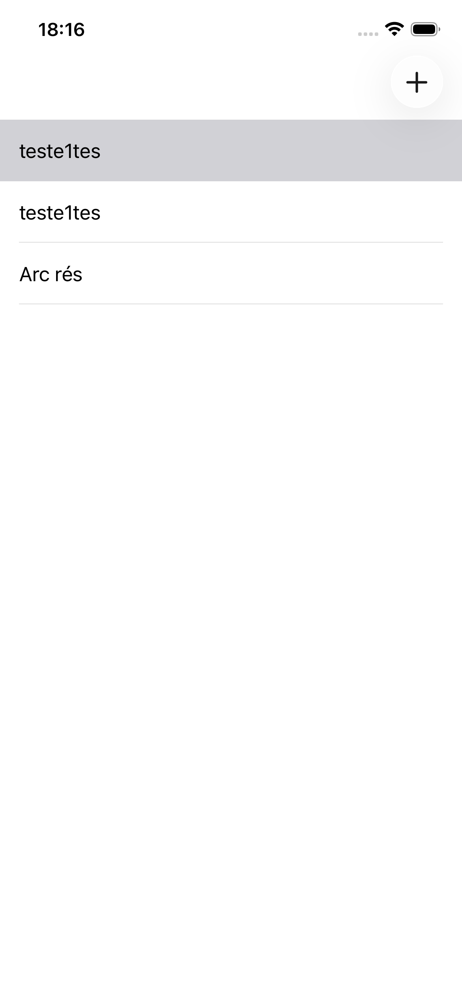
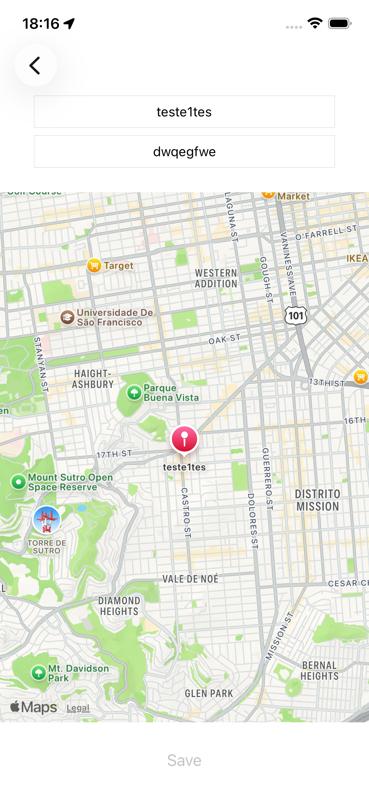
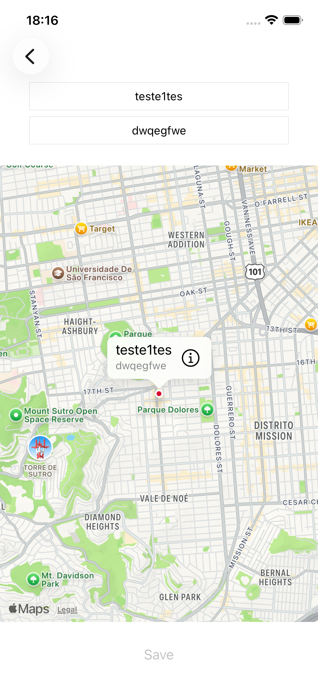

# 📍 TravelBook – iOS Study Project

TravelBook é um aplicativo iOS desenvolvido em **Swift** com o objetivo de registrar e visualizar lugares no mapa.  
O projeto demonstra conceitos fundamentais do desenvolvimento iOS, como **MapKit, CoreLocation, CoreData e UIKit**.

A aplicação permite que o usuário **marque locais no mapa, adicione informações e salve esses dados localmente**, criando uma lista persistente de lugares favoritos.

Este projeto foi criado como estudo prático para consolidar conhecimentos essenciais da plataforma **iOS** e demonstrar habilidades relevantes para a posição de **iOS Developer**.

---

## 📱 Preview

# 🚀 Funcionalidades

## 📍 Marcar locais no mapa

O usuário pode pressionar o mapa por alguns segundos para selecionar um ponto geográfico.

Após selecionar o local, é possível adicionar:

- Nome do lugar
- Comentário ou descrição

Esse ponto é exibido no mapa através de um **Map Annotation (`MKPointAnnotation`)**.

---

## 💾 Persistência de dados com CoreData

Todos os locais adicionados são salvos utilizando **CoreData**, incluindo:

- Nome
- Descrição
- Latitude
- Longitude
- Identificador único (`UUID`)

Isso garante que os dados permaneçam salvos mesmo após fechar o aplicativo.

---

## 📋 Lista de lugares salvos

A tela principal apresenta uma **lista de locais armazenados** utilizando **UITableView**.

O usuário pode:

- Visualizar os lugares cadastrados
- Selecionar um lugar para visualizar no mapa
- Remover lugares da lista

---

## 🗺️ Visualização no mapa

Ao selecionar um local da lista, o aplicativo:

1. Busca os dados no **CoreData**
2. Centraliza o mapa na localização salva
3. Exibe um marcador com nome e descrição

---

## 🧭 Abrir rota no Apple Maps

Ao tocar no botão de detalhes do marcador, o aplicativo abre o **Apple Maps** com a opção de navegação até o local selecionado.

---

# 🧠 Conceitos iOS demonstrados

Este projeto explora vários conceitos importantes para desenvolvimento iOS.

## 📱 UIKit

- `UIViewController`
- `UITableView`
- `NavigationController`
- `Segues`
- `Gesture Recognizers`

---

## 🗺️ MapKit

- `MKMapView`
- `MKAnnotation`
- `MKMarkerAnnotationView`
- Integração com **Apple Maps**

---

## 📍 CoreLocation

- Permissões de localização
- Atualização da posição do usuário
- Centralização do mapa baseada na localização atual

---

## 💾 CoreData

- Persistência de dados
- `NSFetchRequest`
- `NSPredicate`
- Operações **CRUD**

---

## 🔔 Comunicação entre telas

Uso de **NotificationCenter** para atualizar a lista quando um novo local é salvo.

---

# 📲 Fluxo da aplicação

1. O usuário abre o aplicativo e vê a lista de lugares salvos
2. Pressiona o botão **"+"** para adicionar um novo local
3. Pressiona o mapa por alguns segundos para marcar uma localização
4. Adiciona nome e comentário
5. Salva o local
6. O local aparece na lista principal
7. Ao selecionar o item, o mapa mostra a localização salva

---

# 🛠️ Tecnologias utilizadas

- Swift
- UIKit
- MapKit
- CoreLocation
- CoreData
- Xcode

---

# 🎯 Objetivo do projeto

Este projeto foi desenvolvido para **praticar conceitos fundamentais do ecossistema iOS** e demonstrar conhecimento em:

- Persistência de dados
- Manipulação de mapas
- Gerenciamento de localização
- Navegação entre telas
- Arquitetura básica de aplicativos iOS

---

# 👨‍💻 Autor

Desenvolvido por **Willyan Anjos**

Software Engineer com experiência em:

- Java / Spring Boot
- Angular
- Flutter
- PostgreSQL
- iOS (Swift)
